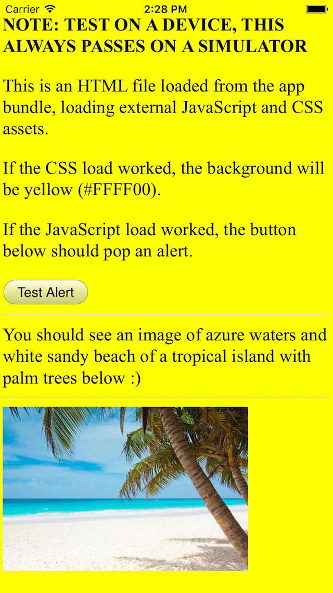
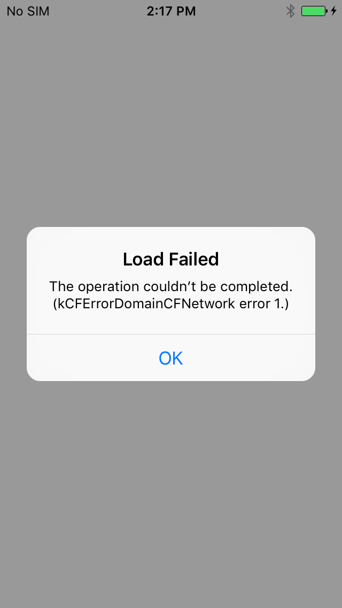

# load-fileurl-app-bundle

iOS 9 test of loading a file url from the app bundle.

[rdar://problem/xxxx](rdar://problem/xxxx)

This test only fails on an iOS 9 device, it always passes on a Simulator.
This test tries to load web assets from a folder in the app bundle itself.

API tested: [loadFileURL:allowingReadAccessToURL:](https://github.com/WebKit/webkit/blob/f5e93b587422c2471cf2b79944ef6b0c3557a7d5/Source/WebKit2/UIProcess/API/Cocoa/WKWebView.h#L101)

## EXPECTED

## ACTUAL

